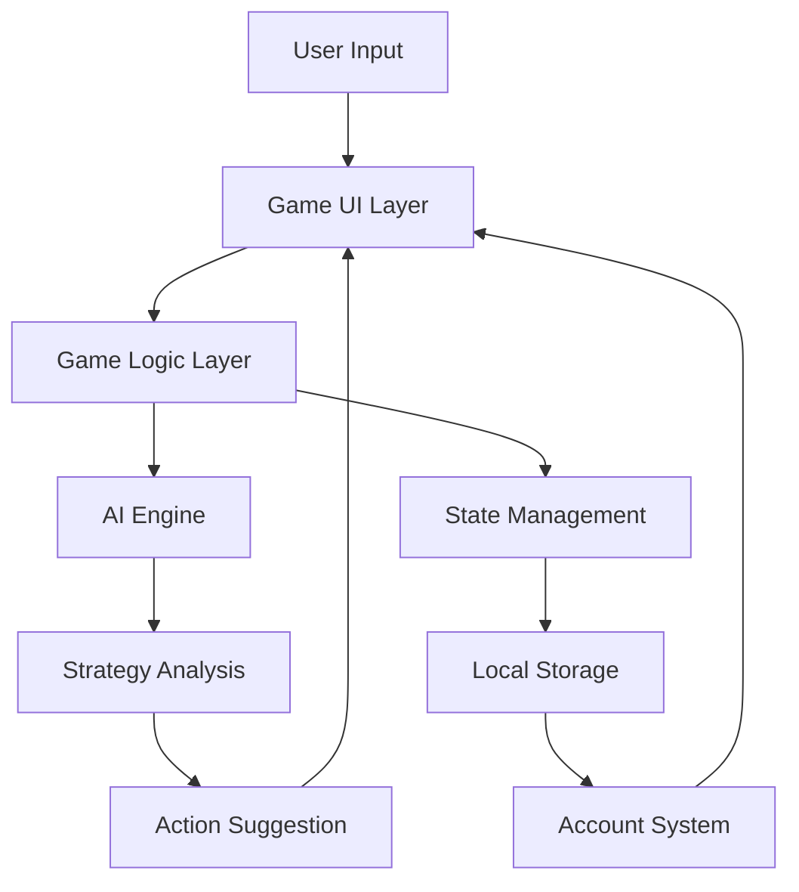

# AI Casino 🎲

A modern, AI-powered casino web application featuring multiple classic casino games with intelligent gameplay assistance and commentary.

## About This Project

AI Casino is a web-based gaming platform that combines traditional casino games with artificial intelligence to create an engaging and educational gaming experience. The project features:

- **Multiple Casino Games:**
  - 🃏 Blackjack
  - ♠️ Poker
  - 🎴 Baccarat
  - 🎲 Craps

- **AI-Powered Features:**
  - Intelligent gameplay suggestions
  - Dynamic commentary on game situations
  - Strategy tips and learning opportunities
  - Adaptive difficulty based on player performance

- **User Features:**
  - Personal account system
  - Game statistics tracking
  - Achievement system
  - Persistent game history

## Technical Architecture

### Project Structure
```
ai-casino/
├── Blackjack AI game.html    # Blackjack game interface
├── poker.html               # Poker game interface
├── baccarat.html           # Baccarat game interface
├── craps.html              # Craps game interface
├── account.html            # User account dashboard
├── BlackJackAI.css         # Global styles
├── account.js              # Account management system
├── blackjack_logic.py      # Blackjack game logic
├── poker_logic.py          # Poker game logic
├── BlackJackAI.js          # Blackjack UI and AI
├── poker.js                # Poker UI and AI
├── baccarat.js             # Baccarat game logic and UI
├── craps.js                # Craps game logic and UI
└── assets/                 # Image assets
    ├── Cards.png           # Card sprites
    └── CardHand.png        # UI elements
```

### Component Architecture

#### 1. User Interface Layer
```javascript
// Example of UI component structure
class GameUI {
    constructor() {
        this.gameContainer = document.querySelector('.game-container');
        this.controlsContainer = document.querySelector('.controls');
        this.aiCommentBox = document.querySelector('.ai-comment');
        this.historyList = document.querySelector('.history-list');
    }

    updateDisplay(gameState) {
        // Update UI based on game state
    }

    handleUserInput(action) {
        // Process user actions
    }
}
```

#### 2. Game Logic Layer
```javascript
// Example of game state management
class GameState {
    constructor() {
        this.currentBet = 0;
        this.playerChips = 1000;
        this.gameHistory = [];
        this.currentHand = [];
    }

    updateState(action) {
        // Update game state based on action
        // Return new state
    }

    validateAction(action) {
        // Validate if action is legal
        // Return boolean
    }
}
```

#### 3. AI Engine Layer
```javascript
// Example of AI decision making
class AIEngine {
    constructor(gameState) {
        this.gameState = gameState;
        this.strategyTable = this.loadStrategy();
    }

    analyzeGameState() {
        // Analyze current game state
        // Return analysis object
    }

    suggestAction() {
        // Generate action suggestion
        // Return action object
    }

    updateStrategy(outcome) {
        // Update AI strategy based on game outcomes
    }
}
```

### Data Flow Architecture



### Technical Implementation Details

#### 1. State Management
- Uses browser's localStorage for persistence
- Implements observer pattern for state updates
- Maintains game history in memory
```javascript
class StateManager {
    constructor() {
        this.observers = [];
        this.gameState = this.loadState();
    }

    subscribe(observer) {
        this.observers.push(observer);
    }

    notify() {
        this.observers.forEach(observer => observer.update(this.gameState));
    }
}
```

#### 2. Event Handling System
- Custom event system for game actions
- Debounced input handling
- Error boundary implementation
```javascript
class EventHandler {
    constructor() {
        this.events = new Map();
    }

    on(event, callback) {
        if (!this.events.has(event)) {
            this.events.set(event, []);
        }
        this.events.get(event).push(callback);
    }

    emit(event, data) {
        const callbacks = this.events.get(event) || [];
        callbacks.forEach(callback => callback(data));
    }
}
```

#### 3. AI Implementation
- Probability calculation engine
- Pattern recognition system
- Dynamic difficulty adjustment
```javascript
class AIStrategy {
    calculateProbability(hand, visibleCards) {
        // Calculate winning probability
        return probability;
    }

    adjustDifficulty(playerSkillLevel) {
        // Adjust AI behavior based on player skill
    }

    generateComment(gameState, action) {
        // Generate contextual commentary
    }
}
```

## How It Works

### Core AI Logic

The project implements several AI-driven systems:

#### 1. Game State Analysis
- The AI continuously analyzes the current game state
- Evaluates player decisions and their outcomes
- Tracks patterns in player behavior
- Calculates optimal plays based on probability

#### 2. Dynamic Commentary System
```javascript
function getAIComment(stage, result = null) {
    const comments = {
        start: [
            "Let's see what the cards have in store for us!",
            "May fortune favor the bold!",
            "The tension builds as we begin..."
        ],
        // Different comment sets for various game situations
    };
    return comments[stage][Math.floor(Math.random() * comments[stage].length)];
}
```
- Provides contextual comments based on game situations
- Offers encouragement and strategic advice
- Maintains player engagement through personalized interaction

#### 3. Statistical Analysis
```javascript
function updateStats(game, isWin, earnings) {
    // Updates player statistics
    // Tracks win rates and earnings
    // Triggers achievements based on performance
}
```
- Tracks player performance across all games
- Calculates win rates and earnings
- Identifies areas for improvement
- Awards achievements based on milestones

#### 4. Game-Specific AI Logic

**Blackjack:**
- Calculates optimal plays based on basic strategy
- Tracks card history for strategic suggestions
- Adapts recommendations based on player style

**Poker:**
- Evaluates hand strengths
- Suggests optimal betting strategies
- Provides probability-based advice

**Baccarat:**
- Analyzes betting patterns
- Tracks banker/player win streaks
- Offers strategic betting suggestions

**Craps:**
- Calculates odds for different bet types
- Suggests optimal betting combinations
- Tracks point number statistics

## How to Run It

### Prerequisites
- A modern web browser (Chrome, Firefox, Safari, or Edge)
- Basic understanding of casino games
- No server-side setup required - runs entirely in the browser

### Technical Requirements
- ECMAScript 2020+ support
- Local storage enabled
- Minimum 1GB RAM
- WebGL support for animations (optional)

### Installation
1. Clone the repository:
   ```bash
   git clone https://github.com/yourusername/ai-casino.git
   ```

2. Navigate to the project directory:
   ```bash
   cd ai-casino
   ```

3. Open any of the game HTML files in your web browser:
   - `Blackjack AI game.html`
   - `poker.html`
   - `baccarat.html`
   - `craps.html`

### Development Setup
1. **Environment Setup**
   ```bash
   # Optional: Set up a local server
   python -m http.server 8000
   # or
   npx http-server
   ```

2. **Development Tools**
   - Browser DevTools for debugging
   - Source maps enabled in CSS
   - Console logging for game state

3. **Testing**
   ```javascript
   // Run unit tests (if implemented)
   npm test
   
   // Test specific game logic
   npm test -- --game=blackjack
   ```

### Deployment

#### Local Deployment

1. **Simple HTTP Server**
   ```bash
   # Using Python
   python -m http.server 8000
   
   # Using Node.js
   npx http-server -p 8000
   
   # Using PHP
   php -S localhost:8000
   ```
   Access the application at `http://localhost:8000`

2. **Using Docker**
   ```dockerfile
   # Dockerfile
   FROM nginx:alpine
   COPY . /usr/share/nginx/html
   ```

   ```bash
   # Build and run the Docker container
   docker build -t ai-casino .
   docker run -p 80:80 ai-casino
   ```
   Access the application at `http://localhost`

#### Cloud Deployment

1. **GitHub Pages**
   ```bash
   # Create gh-pages branch
   git checkout -b gh-pages
   
   # Push to GitHub
   git push origin gh-pages
   ```
   - Enable GitHub Pages in repository settings
   - Site will be available at `https://[username].github.io/ai-casino`

2. **Netlify**
   - Connect your GitHub repository to Netlify
   - Configure build settings:
     ```toml
     # netlify.toml
     [build]
       publish = "."
       command = ""  # No build command needed for static files
     ```
   - Site will be deployed automatically on push

3. **AWS S3 Static Website**
   ```bash
   # Install AWS CLI
   aws configure  # Set up your AWS credentials
   
   # Create S3 bucket and enable static website hosting
   aws s3 mb s3://your-casino-bucket
   aws s3 website s3://your-casino-bucket --index-document "Blackjack AI game.html"
   
   # Upload files
   aws s3 sync . s3://your-casino-bucket --exclude ".git/*" --exclude "README.md"
   
   # Make files public
   aws s3api put-bucket-policy --bucket your-casino-bucket --policy file://policy.json
   ```
   
   Example S3 bucket policy (policy.json):
   ```json
   {
     "Version": "2012-10-17",
     "Statement": [
       {
         "Sid": "PublicReadGetObject",
         "Effect": "Allow",
         "Principal": "*",
         "Action": "s3:GetObject",
         "Resource": "arn:aws:s3:::your-casino-bucket/*"
       }
     ]
   }
   ```

4. **Azure Static Web Apps**
   ```bash
   # Install Azure CLI
   az login
   
   # Create static web app
   az staticwebapp create \
     --name "ai-casino" \
     --resource-group "your-resource-group" \
     --source "https://github.com/username/ai-casino" \
     --branch "main" \
     --app-location "/"
   ```

#### Security Considerations

1. **Content Security Policy**
   Add to HTML files:
   ```html
   <meta http-equiv="Content-Security-Policy" 
         content="default-src 'self'; script-src 'self' 'unsafe-inline'; style-src 'self' 'unsafe-inline';">
   ```

2. **HTTPS Configuration**
   - Use HTTPS for all deployments
   - Redirect HTTP to HTTPS
   - Configure SSL certificates

3. **Environment Variables**
   ```javascript
   // config.js
   const config = {
     apiKey: process.env.API_KEY,
     environment: process.env.NODE_ENV || 'development',
     analytics: process.env.ENABLE_ANALYTICS || false
   };
   ```

#### Post-Deployment Checklist

1. **Performance Verification**
   - Test load times
   - Verify all games work
   - Check mobile responsiveness
   - Validate localStorage functionality

2. **Browser Testing**
   - Chrome (latest)
   - Firefox (latest)
   - Safari (latest)
   - Edge (latest)
   - Mobile browsers

3. **Monitoring Setup**
   ```javascript
   // Add basic error tracking
   window.onerror = function(msg, url, lineNo, columnNo, error) {
     console.error('Error: ' + msg + '\nURL: ' + url + '\nLine: ' + lineNo);
     // Send to your monitoring service
   };
   ```

4. **Analytics Integration**
   ```html
   <!-- Add to HTML files -->
   <script async src="your-analytics-script.js"></script>
   ```

### Playing the Games

1. **Create an Account**
   - Click the user menu in the top-right corner
   - Enter your name to start tracking your progress

2. **Select a Game**
   - Choose from the game menu on the left
   - Each game has its own unique AI assistance

3. **Place Bets**
   - Use the betting controls to set your wager
   - The AI will suggest optimal bet sizes based on your bankroll

4. **Play and Learn**
   - Follow the AI's suggestions to improve your game
   - Track your progress in the account section
   - Earn achievements as you master each game

### Local Development
- All game logic is client-side JavaScript
- CSS styles are in `BlackJackAI.css`
- Each game has its own JavaScript file
- Account system uses localStorage for persistence

## Contributing

Feel free to fork this project and submit pull requests. Areas for potential improvement:

- Additional casino games
- Enhanced AI algorithms
- More achievements
- Multiplayer functionality
- Advanced statistics tracking

## License

© Edgar Cardona, 2025. All Rights Reserved. 